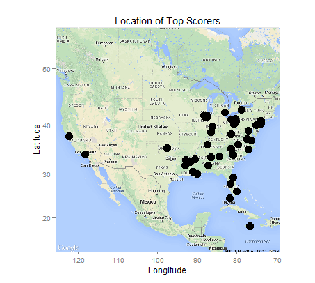

```{r,echo=FALSE, warning=FALSE,message=FALSE}
library(dplyr)
library(ggplot2)
library(ggmap)
library(gridExtra)
library(reshape2)
library(tm)
library(wordcloud)
library(stringr)
library(reshape2)
library(scales)
```

```{r,echo=FALSE, warning=FALSE,message=FALSE}

##Load data tables into the global environment.

NBAdata=read.csv("C:/Users/Aaron Grenz/Documents/GitHub/abresler.github.io/data/NBA/Players/NBA-ABA Birthplaces/all_data.csv")

NBAsales = read.csv("C:/Users/Aaron Grenz/Documents/GitHub/abresler.github.io/data/NBA/Franchises/Sales/final_nba_sales_history.csv")

playerSalaries = read.csv("C:/Users/Aaron Grenz/Documents/GitHub/abresler.github.io/data/NBA/Salaries/data/lists/Old/NBA Player Salaries List 2013-2019.csv")

lastYearStats = read.csv("C:/Users/Aaron Grenz/Documents/GitHub/abresler.github.io/data/NBA/2013-2014 Stats.csv")

load("C:/Users/Aaron Grenz/Documents/GitHub/abresler.github.io/data/NBA/textdataclouds/textdata.rda")

playerAgents = read.csv("C:/Users/Aaron Grenz/Documents/GitHub/abresler.github.io/data/NBA/Agents/data/Lists/Players Agents List 2013-2018.csv")

```

\newpage

#1. Free throws versus minutes per game.
This graph displays the free throw percentage versus minutes per game. The data was obtained from the NBAdata set. Years, minutes per game, rebounds per game, and free throw percentage were selected from the data set. Next, we filtered the data by selecting players who played greater than seven years and who had less than three rebounds per game. The graph shows a positive correlation between free throw percentage and the amount of minutes per game. The correlation coefficient for this data is 0.429.

```{r,echo=FALSE, warning=FALSE,message=FALSE}

assFT=NBAdata %>%
  select(years,mpg,ft,rpg) %>%
  filter(years>=7,rpg<3) %>%
  arrange(-mpg)

#cor(assFT$mpg,assFT$ft,use="everything")

ggplot(assFT,aes(x=mpg, y=ft))+geom_point() + geom_smooth(color="black", se=FALSE) + ggtitle("Minutes per Game vs. Free Throws %") + xlab("Minutes per Game") + ylab("Free Throw %") + theme_bw()
```

\newpage

#2. Sales of teams for each division across the decades.
This graph displays the sales of teams in each division across several decades. The data was obtained from NBAsales data set.  Inflation was taken into account by converting the sales prices to 2014 dollar amounts.  Even with the value of the dollar the same across all decades, there is a spike in the overall total sale dollars.  This can be attributed to a higher interest in NBA basketball and more money being funneled into league.

```{r,echo=FALSE, warning=FALSE,message=FALSE}

ggplot(NBAsales,aes(x=decade,y=price_2014_dollars)) + geom_bar(stat="identity") + ggtitle("Sales of Teams") + theme(legend.position="none") + facet_wrap(~division,ncol=3) + theme_bw() + xlab("Decade") + ylab("Sale Price") + theme(axis.text.x = element_text(angle=-90), axis.text.y = element_blank()) + theme(strip.text.x = element_text(colour="red"), axis.text.y = element_blank())
```

\newpage

#3. Sales of teams for each division across the decades.

The figures below displays the most common reasons for a change in ownership for NBA teams across all divisions. The size of the font of the word corresponds to the frequency of occurrence for the sale. The most common reasons throughout all divisions were "purchase" and "expansion". The data was obtained from NBA sales.

##ATLANTIC


##CENTRAL


##NORTHWEST


##PACIFIC


##SOUTHEAST


##SOUTHWEST


\newpage

#3.5. Salary of Kim Kardashion vs. Kris Humphries
This graph compares Kim Kardashions wage to her ex-husbands, Kris Humphries. Information on Kim Kardashions salary was obtained from Forbes.

```{r,echo=FALSE, warning=FALSE,message=FALSE}

combined=NBAdata %>% inner_join(playerSalaries) %>% 
  filter(season=="2013-2014", player=="Kris Humphries") %>% 
  select(season,player,mpg,salary)

combined$season=as.character(combined$season)
combined$player=as.character(combined$player)
combined[2,]=c("2013-2014","Kim Kardashian",NA,28000000,NA,NA)

combined$salary=as.numeric(combined$salary)

ggplot(combined,aes(x=player,y=salary)) + geom_bar(stat="identity") + ggtitle("Kim Kills Kris") + theme_bw() + xlab("Famous, Rich People") + ylab("Really Big Salary") + theme(plot.title= element_text(colour="purple")) + scale_y_continuous(labels=comma)

```

\newpage

#4. Player's hourly wage.
This graph displays several 2013-2014 player's wage per minute played. The data set was obtained from ESPN. The y-axis represents the player's wage per minute played. This was calculated by dividing each player's salary for the year divided by the number of minutes played.  Danny Granger had the highest paid wage per minute.

```{r,echo=FALSE, warning=FALSE,message=FALSE}

combined=lastYearStats %>% inner_join(playerSalaries) %>%
  filter(season=="2013-2014", GP>40) %>%
  mutate(mpy=GP*MIN.per.game) %>%
  mutate(Money_per_Minute =salary/mpy) %>%
  filter(Money_per_Minute>9000) %>%
  arrange(-Money_per_Minute)
  
ggplot(combined,aes(x=reorder(player,-Money_per_Minute),y=Money_per_Minute)) + geom_bar(stat="identity") + ggtitle("Player's Wage per Minute") + theme_bw() + xlab("Playa, playa, playa") + ylab("Dolla dolla per minute") + theme(plot.title= element_text(colour="blue")) + theme(axis.text.x = element_text(angle=-90, colour="red"), axis.text.y = element_text(colour="green"))

```

\newpage

#5. Top player agents for the 2014-2015 season.
This graph shows the top agencies for the 2014-2015 season. Data was obtained from the playerAgents data set. Creative Artists was the top agency with four major sales between 2014-2015. The top agency was determined by combining all the sales that were over $19,500,000.  

```{r,echo=FALSE, warning=FALSE,message=FALSE}

agent= playerAgents %>%
  select(agency,salary,player,season) %>%
  filter(season=="2014-2015",salary>19500000) %>%
  arrange(-salary)

ggplot(agent,aes(x=agency,y=salary, fill=player)) + geom_bar(stat="identity") + ggtitle("Top Player Agents") + theme_bw() + xlab("Hot Agents") + ylab("Making $$$") + theme(axis.text.x = element_text(angle=-90), axis.text.y = element_text()) + scale_y_continuous(labels=comma)

```

\newpage

#6. Map of the birthplaces for the top scoring NBA players.

```{r,echo=FALSE, eval=FALSE, warning=FALSE,message=FALSE}

scorer=NBAdata %>%
  filter(ppg>20.0)

location=c(-125,24.207,-70,50)

map=get_map(location=location, maptype="roadmap", source="google")
usmap=ggmap(map)

locs=geocode(as.character(unique(scorer$hometown)))
locs$hometown=unique(scorer$hometown) 
scorer$latitude=locs$lat[ match(scorer$hometown,locs$hometown)]
scorer$longitude=locs$lon[ match(scorer$hometown,locs$hometown)]

# The plot
usmap+geom_point(data=scorer,aes(x=longitude,y=latitude),size=5)+ ggtitle("Location of Top Scorers")+ xlab("Longitude") + ylab("Latitude")
```

This map is a visual display showing the location of players who on average twenty points or more. Interestingly, most players were from the east coast.


